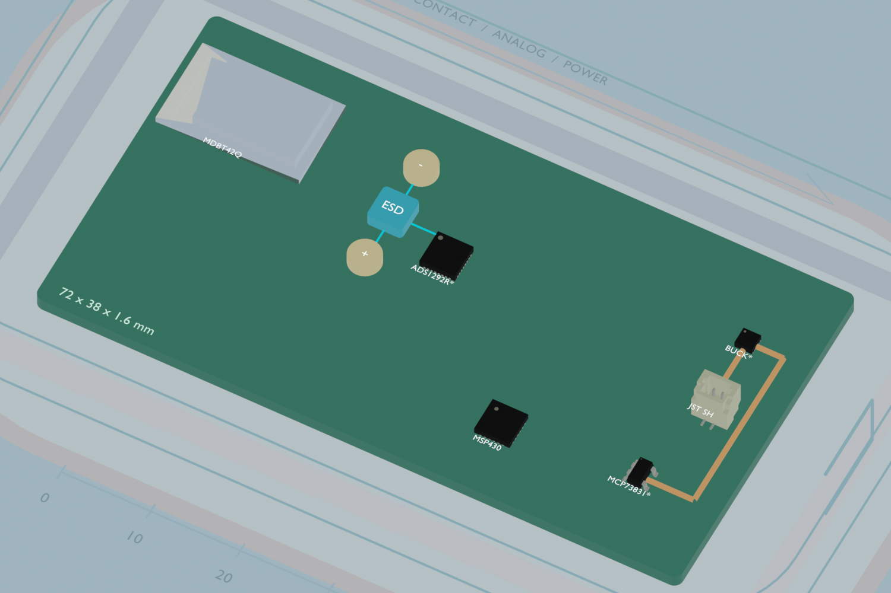

# MissionPCB

## Current Blender demo

Open [the working ECG scene](missionpcb_blender_demo/component_pass/missionpcb_three_cad_components.blend). It contains six imported component models, a close-up inspection camera, and interactive placement checks. The ECG chip and buck use explicitly approximate packages. [Scene guide and verification](missionpcb_blender_demo/component_pass/README.md).



MissionPCB is an AI hardware engineer that generates PCB designs from real-world mission constraints and validates them with simulation before you build.

This repo is the working space for our Astra hack project. The current goal is to build a lean but convincing prototype that shows how MissionPCB thinks differently from generic AI PCB tools: it starts from the mission, extracts constraints, creates a board/enclosure simulation, checks failure modes, and explains why a design passes or fails.

## Core Idea

Existing AI PCB tools help with parts, schematics, routing, and general PCB workflows. MissionPCB is aimed at higher-constraint hardware work where the important design questions are not only "can this circuit be drawn?" but:

- Will the board fit inside the actual product?
- Will hot components damage people, sensors, batteries, or nearby modules?
- Do noisy parts interfere with sensitive sensors or RF modules?
- Does the design still work under real operating conditions?
- What risks remain before manufacturing?

Our first demo should stay lean. It should not try to solve all PCB design in one shot. It should prove the product thesis visually and technically: MissionPCB can turn messy real-world requirements into a structured constraint model and an inspectable 3D simulation.

## Recommended First Demo

Build a Blender-based 3D simulation of a constrained PCB inside a transparent electronics enclosure.

The demo should show two side-by-side layouts:

- **Naive Layout:** a plausible but bad first-pass board with visible failures.
- **MissionPCB Layout:** a corrected board that satisfies or explains the key constraints.

Only include three constraint types at first:

- Mechanical fit inside the enclosure
- Approximate heat zones around hot components
- Separation between sensitive and noisy components

This is enough to communicate the wedge without overbuilding.

## Why Blender First

Use Blender for the first prototype because it is fast, scriptable, visual, and interactive. Astra can generate Blender Python, run it, inspect renders, and revise the scene. Blender also lets teammates orbit, zoom, select individual parts, and inspect the design from any angle.

Fusion or other CAD tools may become useful later for CAD-grade enclosure import, manufacturing workflows, or enterprise integrations. For the hack/demo, Blender is the fastest path to an impressive simulation.

## Demo Mission: Single-Lead ECG Chest Patch

The demo is built around one concrete product: a single-lead ECG chest patch.
It was chosen because a single BOM exercises every constraint type in the brief
at once — patient-contact surface (temperature limit), microvolt biosignal
(noise floor), BLE radio (RF separation), LiPo cell (battery safety), and a
thin sealed enclosure (mechanical fit). Nothing else in medtech gives that
coverage as cheaply.

## Architecture: judgment versus arithmetic

The system splits in two, and keeping the split clean is the whole design.

**A language model decides what the rules are.** "Worn against skin all day"
and "shouldn't look like a medical device" are real hardware constraints with
no closed form. Turning them into `skin_contact: true` and
`max_surface_temp_c: 43` is judgment, and only a model can do it. The same is
true on the way out: `REG→AFE 6.0mm < 15mm FAIL` is a linter, while "the
regulator sits under the skin-contact face and will push that surface past the
43 °C limit during a charge cycle" is an engineer.

**Deterministic code decides whether the rules are met.** Once something has
asserted that the front end needs 15 mm, measuring 6.0 mm is subtraction. Never
ask a model to compute a distance: it will be right most of the time and wrong
unpredictably, which is the one failure you cannot reproduce afterwards.
Computing it in code is free, exact, and identical every run.

The constraint engine is the second half. It is stdlib-only and fully
deterministic, and it imports directly into Blender's bundled Python.

```
Mission (LLM)  ->  parts + layout JSON  ->  constraint engine  ->  results + overlays  ->  Blender
                                                     |
                                                     +->  explain brief  ->  write-up (LLM)
```

## Try it

```bash
./run_demo.sh
```

Validates a deliberately constraint-blind layout (10 failures across every
constraint family), solves for a corrected one, re-validates it through the
same code path, and emits the LLM explanation brief.

```
ECG Patch - Naive Layout        FAIL     35     10
ECG Patch - MissionPCB Layout   PASS     45      0
ECG Patch - MissionPCB Solved   PASS     45      0
```

Tests: `PYTHONPATH=src python3 -m pytest tests/ -q`

## Main Docs

Start here:

- [MissionPCB product and build brief](docs/missionpcb-product-build-brief.md) — product thesis and roadmap
- [Constraint engine contract](docs/constraint-engine-contract.md) — the JSON interface between parts data, the engine, and Blender
- [Mission intake](docs/mission-intake.md) — how plain English becomes structured constraints

## Repo Layout

```text
src/constraint_engine/   deterministic checker, solver, and report generator
parts/                   parts libraries (generic seed + ECG patch BOM)
layouts/                 enclosure, board, and placements per design variant
tests/                   172 tests, including the demo's golden behaviour
docs/                    product brief and interface contracts
run_demo.sh              one-button pipeline
```

