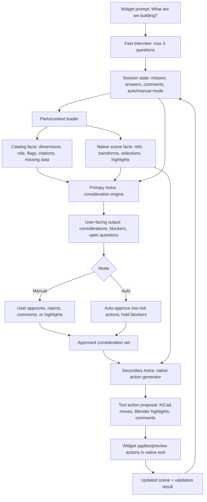

# Astra Widget Backend Loop

MissionPCB is a loop around native EE tools, not a standalone editor.

```text
user prompt
  -> parts/catalog context
  -> Astra consideration pass
  -> user review or auto mode
  -> Astra native-tool generation pass
  -> KiCad/Blender view update
  -> widget comments/edits/highlights
  -> repeat
```

## Core Loop

### 1. User Prompt

The widget starts with one natural-language question:

```text
What are we building?
```

Example:

```text
Build a rechargeable single-lead ECG patch for continuous 7-day wear. It should
stream over BLE, fit in a thin sealed enclosure, and be safe against patient
skin.
```

The widget then asks at most three short follow-up questions. These answers are
part of the prompt context, not a separate form system.

Example answers:

- wear duration: `7 days continuous`
- power strategy: `rechargeable LiPo`
- priority: `patient safety`

### 2. Get Parts

Backend gathers the relevant part context:

- selected BOM
- candidate alternatives by role
- catalog facts
- package dimensions
- electrical/thermal/RF/mechanical flags
- citations and missing-data notes
- current native-scene component transforms

Current repo sources:

- `parts/catalog/`
- `parts/ecg-patch-parts.json`
- `layouts/ecg-patch-*.json`
- `render/naive.json`
- `render/solved.json`
- Blender object metadata:
  - `component_ref`
  - `part_id`
  - `category`
  - `geometry_source`
  - `approximate`

### 3. Astra Consideration Pass

Primary Astra receives:

```json
{
  "mission": "...",
  "answers": {},
  "parts": [],
  "current_scene": {},
  "user_comments": [],
  "mode": "review"
}
```

Primary Astra outputs possible considerations for the user:

```json
{
  "considerations": [],
  "blockers": [],
  "open_questions": [],
  "candidate_constraints": [],
  "suggested_part_changes": [],
  "highlight_instructions": []
}
```

This is where Astra should find what is worrisome:

- battery too tall for enclosure
- missing charger/protection
- regulator cannot maintain required rail across battery range
- AFE near noise/heat source
- antenna keep-out risk
- missing data that blocks pilot readiness

### 4. User Review Or Auto Mode

The widget has two modes.

Manual mode:

- show considerations
- ask user to approve, reject, or comment
- no native tool mutation until user approves

Auto mode:

- Astra can apply low-risk changes automatically
- widget still logs every change
- blocker-severity changes still require approval unless explicitly overridden

User comments become loop input:

```text
Keep this antenna edge clear.
Can we use a thinner cell?
Explain why this regulator is unsafe.
```

### 5. Astra Native-Tool Generation Pass

Secondary Astra receives the approved considerations plus current scene state.
It outputs native-tool actions, not prose.

```json
{
  "proposal_id": "p_001",
  "target_tool": "kicad",
  "actions": [
    {
      "type": "move_component",
      "component_ref": "BUCK",
      "to_mm": [18.0, 8.0],
      "reason": "Increase separation from AFE"
    },
    {
      "type": "add_highlight",
      "component_refs": ["AFE", "BUCK"],
      "category": "conducted",
      "label": "Noise separation"
    }
  ],
  "requires_user_apply": true
}
```

For the demo, KiCad action output may be a structured proposal if no native
KiCad board is connected. Blender can still update the visual scene and
highlights.

### 6. Native View Update

The widget applies approved actions to the native tool:

- select object
- frame object
- move component
- add translucent constraint volume
- add label
- export artifact
- run connected validation if available

Tool-specific responsibilities:

- Blender: 3D model, enclosure, highlights, comments, visual proposal preview
- KiCad: footprints, PCB placement, ERC/DRC, board-source updates when connected

### 7. Repeat

Every loop iteration records:

- mission and answers
- user comments
- Astra input payload
- Astra output payload
- proposed actions
- applied actions
- exported artifacts

The next Astra call receives this state so the conversation is cumulative.

## Backend Engine Map



The loop matters because every user interjection becomes new engine context. A
comment like `keep the antenna edge clear` should not be transient chat text;
it becomes a session constraint, a viewport annotation, and part of the next
Primary Astra call.

The core backend object should be a session record:

```json
{
  "session_id": "s_001",
  "mission": "...",
  "answers": {},
  "mode": "manual",
  "parts": [],
  "scene": {},
  "comments": [],
  "considerations": [],
  "approved_considerations": [],
  "native_action_proposals": [],
  "applied_actions": []
}
```

Primary Astra is responsible for engineering judgment. It should say what to
look at and why: heat, radiation/RF, noise, mechanical clearance, missing
protection, missing dimensions, sourcing risk, and regulatory readiness.

Secondary Astra is responsible for tool execution. It should not rediscover the
problem; it should convert approved considerations into safe native actions:
select, frame, highlight, add keepout, move footprint, preview route, attach
comment, export, or request approval.

## Dhruva Widget Baseline

The pushed simulation baseline is the committed `render/` contract, not a
separate widget package.

- `render/naive.json`: the visible failure state with components, failed
  checks, overlays, heat zones, and RF keep-outs.
- `render/solved.json`: the corrected visible state with the same schema.

The widget should use those files as the native-view contract. It can show the
user the rendered board, collect comments, and ask Astra what to do next, but
it should not invent component geometry when `render/*.json` already carries
positions, dimensions, checks, and overlay instructions.

The Blender scaffold is `blender/missionpcb_widget.py`. It is intentionally a
small chat widget, not a replacement editor:

- prompt: `What are we building?`
- message box for edits, comments, and highlight requests
- Auto mode toggle
- transcript preview
- findings pulled from `render/naive.json`
- Focus, Apply, and Export actions

## Export And Manufacturing

There are two export layers:

- `/api/design/export`: raw design, engine layout, analysis, and history.
- `/api/manufacturing/export`: demo manufacturing handoff with BOM rows,
  available files, missing files, validation risks, manufacturing steps, and
  planning cost bands.

The manufacturing export must be honest in the demo. If KiCad is not connected,
Gerbers, drill files, BOM/CPL, native ERC/DRC, and assembly drawings remain
`pending`. Blender renders are visual review artifacts, not fabrication data.

## Backend Services

Recommended split:

```text
widget
  -> /api/widget/intake
  -> /api/astra/consider
  -> /api/astra/generate-native-actions
  -> /api/widget/apply
  -> /api/widget/export
```

### `/api/widget/intake`

Creates or resumes a widget session.

Input:

```json
{
  "mission": "...",
  "answers": {},
  "tool": "blender",
  "scene": {}
}
```

Output:

```json
{
  "session_id": "s_001",
  "next": "consider"
}
```

### `/api/astra/consider`

Primary Astra pass.

Input:

```json
{
  "session_id": "s_001",
  "parts": [],
  "mission": "...",
  "answers": {},
  "scene": {},
  "comments": []
}
```

Output:

```json
{
  "considerations": [],
  "blockers": [],
  "open_questions": [],
  "highlight_instructions": []
}
```

### `/api/astra/generate-native-actions`

Secondary Astra pass.

Input:

```json
{
  "session_id": "s_001",
  "approved_considerations": [],
  "scene": {},
  "target_tool": "kicad"
}
```

Output:

```json
{
  "proposal_id": "p_001",
  "actions": [],
  "requires_user_apply": true
}
```

### `/api/widget/apply`

Applies an approved proposal to the native tool state.

Input:

```json
{
  "session_id": "s_001",
  "proposal_id": "p_001",
  "mode": "manual"
}
```

Output:

```json
{
  "applied": true,
  "revision": 2,
  "rerun_required": true
}
```

## Widget UI States

```text
idle
  -> interviewing
  -> considering
  -> waiting_for_user
  -> generating_actions
  -> previewing
  -> applying
  -> rerunning
  -> waiting_for_user
```

## What Exists Today

Implemented:

- parts catalog
- app design state
- local analysis adapter
- chat proposal demo mode
- Blender GLB builder
- initial Blender widget scaffold
- fixture for primary/secondary Astra boundary

Missing:

- live Astra endpoint call
- true primary Astra overlap/worry analysis
- true secondary Astra KiCad manipulation pass
- native KiCad project connection
- production Blender widget polish
- persisted widget sessions/history
- comment anchoring in the native viewport

## Demo Interpretation

For the hack demo, be explicit:

- If Astra keys/endpoints are absent, use fixture mode and label it.
- If KiCad is not connected, output KiCad actions as proposals only.
- Blender is the visual native-tool surface for the demo.
- The loop still works: prompt, parts, considerations, user approval, native
  action proposal, highlight/update, repeat.
