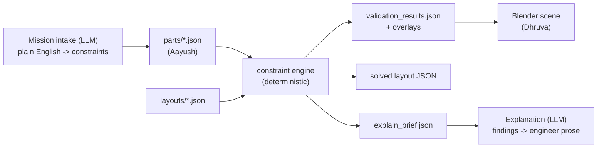

# Constraint Engine Contract

The interface between the three workstreams. Aayush produces parts data,
Dhruva consumes results in Blender, the engine sits in the middle and turns
one into the other.



## The one rule: judgment versus arithmetic

This split is the whole architecture. Getting it wrong breaks the demo.

**A language model decides what the rules are.** Turning "worn against skin all
day" into `skin_contact: true` and `skin_contact_clearance_mm: 15` has no closed
form. Neither does turning a failure into "the regulator sits under the
skin-contact face and will push that surface past the 43 °C limit during a
charge cycle — move it to the non-contact edge or drop charge current to
100 mA." Only a model can do either.

**Deterministic code decides whether the rules are met.** Once something has
asserted "the front end needs 15 mm from the regulator", measuring 6.0 mm is
subtraction.

Never ask a model to compute a distance. It will be right most of the time and
wrong unpredictably, which is exactly the failure you cannot reproduce
afterwards. Computing it here is free, exact, and identical every run —
including live. It costs the model nothing: it still sets every number that
matters.

Concretely, in this repo:

| Decided by a model | Computed by code |
| --- | --- |
| Which parts the product needs | Where their bounding boxes land |
| That an electrode touches skin | How far it is from the regulator |
| That skin contact means 15 mm | Whether 13.5 mm clears 15 mm |
| That a lead vector needs 35 mm | That these electrodes span 16 mm |
| Why a failure matters, and the options | Which checks failed, and by how much |

Nothing in `src/constraint_engine/` calls a model, imports a network library,
or samples anything. It is stdlib-only and fully deterministic.

---

## Running it

No install step. Blender's bundled Python has no pip, so the package is plain
stdlib on `sys.path`.

```bash
PYTHONPATH=src python3 -m constraint_engine validate \
    --parts parts/ecg-patch-parts.json \
    --layout layouts/ecg-patch-naive.json \
    --out out/naive

PYTHONPATH=src python3 -m constraint_engine solve \
    --parts parts/ecg-patch-parts.json \
    --layout layouts/ecg-patch-naive.json \
    --out layouts/ecg-patch-solved.json

PYTHONPATH=src python3 -m constraint_engine compare \
    --parts parts/ecg-patch-parts.json \
    --layouts layouts/ecg-patch-naive.json layouts/ecg-patch-solved.json

PYTHONPATH=src python3 -m constraint_engine explain \
    --parts parts/ecg-patch-parts.json \
    --layout layouts/ecg-patch-naive.json --stdout
```

Or just `./run_demo.sh`, which runs the whole sequence.

Exit codes: `0` everything passed, `1` failures present, `2` bad input.

---

## For Aayush: the parts file

A JSON array, or an object with a `parts` array. **The loader is deliberately
forgiving** — write clearances whichever way is natural and it will normalize.
If it has to assume something it emits a warning that shows up in the report,
so nothing is ever silently guessed.

```jsonc
{
  "id": "afe-ecg-24bit",              // required, referenced by layouts
  "name": "ECG Analog Front End",
  "category": "analog_frontend",      // aliases below
  "dimensions_mm": { "length": 5, "width": 5, "height": 1.0 },

  "heat_source": false,               // or "thermal_risk": "high"
  "noise_source": false,
  "sensitive": "high",                // none | low | medium | high, or true/false
  "skin_contact": false,              // patient-contact surface
  "thermal_runaway_risk": false,      // implied for category "battery"

  "heat_zone_radius_mm": 10,          // implies heat_source
  "keepout_zone_mm": { "extends": 8, "width": 8, "direction": "+y" },

  // Style A - keyed by what the OTHER part does:
  "required_clearance_mm": { "from_hot_components": 10, "from_noisy_components": 15 },

  // Style B - keyed by what the OTHER part IS. Both work, and you can mix them
  // in one part. When two rules cover the same pair, the larger one wins.
  "min_distance_mm": { "rf": 20, "power": 15 },
  "avoid_near": ["sensor"],           // no distance given -> 10 mm, with a warning

  "placement_notes": "Free text. Shown to the explanation layer.",
  "source_url": "https://..."
}
```

**Accepted aliases.** Categories: `rf`/`radio`/`antenna` → `wireless`;
`mcu`/`cpu` → `processor`; `power`/`regulator`/`dcdc` → `power_regulator`;
`motor`/`load` → `driver`; `lipo`/`cell` → `battery`; `afe`/`imu` → `sensor`.
Clearance keys: `from_hot_components`/`from_hot`/`hot`/`heat`/`thermal` all mean
"hot", and the same pattern for noisy. Dimensions can be
`dimensions_mm`/`size_mm`/`dimensions`/`size`, an object with
`length`/`width`/`height` or `l`/`w`/`h` or `x`/`y`/`z`, a 3-element array, or
flat `length_mm`/`width_mm`/`height_mm` keys. Numbers may be strings
(`"4mm"` parses).

**What breaks it:** malformed JSON, an empty parts list. Everything else
degrades to a warning. A missing part referenced by a layout produces a `WARN`
row and the component is excluded from every check — it is never silently
dropped.

---

## Layout files

```jsonc
{
  "name": "ECG Patch - Naive Layout",
  "description": "Free text, passed to the explanation layer.",
  "distance_metric": "edge",          // edge (default) or center

  // Product-specific justification per rule family, authored upstream.
  // The checker never invents these; it falls back to generic physics.
  "rationales": {
    "sep.noise": "The ECG signal at the front end is roughly 1 mV...",
    "safety.skin_contact_temp": "IEC 60601-1 caps skin contact at 43 C..."
  },

  "mission": {
    "skin_contact_clearance_mm": 15,
    "battery_thermal_clearance_mm": 8
  },

  // Constraints no generic PCB rule implies.
  "mission_rules": [
    {
      "id": "lead_vector",
      "type": "min_separation",       // or max_separation
      "between": ["ELEC_A", "ELEC_B"],
      "distance_mm": 35,
      "metric": "center",             // center or edge
      "severity": "blocker",
      "title": "ECG lead vector is long enough to resolve",
      "rationale": "..."
    }
  ],

  "enclosure": {
    "interior_mm": { "length": 104, "width": 34, "height": 8.5 },
    "wall_thickness_mm": 1.5,
    "wall_keepout_mm": 2.0,
    "openings": [{
      "id": "charge_window",
      "face": "-x",                   // +x -x +y -y
      "center_mm": 20,                // along that face's span
      "size_mm": { "width": 20, "height": 5 },
      "max_reach_mm": 12              // how deep a connector may sit
    }]
  },

  "board": {
    "id": "PCB_Naive",
    "size_mm": { "length": 94, "width": 26, "thickness": 1.0 },
    "origin_mm": [5, 4, 1],           // board min-corner in enclosure coords
    "edge_margin_mm": 1.5,
    "max_component_height_mm": 6.5,
    "min_component_gap_mm": 0.5       // IPC-7351 courtyard
  },

  "placements": [
    { "ref": "AFE", "part_id": "afe-ecg-24bit", "pos_mm": [34, 15],
      "rotation_deg": 0, "anchored": false }
  ],

  "traces": [
    { "id": "charge_run", "net": "VBUS", "path_mm": [[86,10],[88,26]],
      "width_mm": 1.0, "high_current": true }
  ]
}
```

`pos_mm` is the component **center** in board-local mm. Rotation is restricted
to multiples of 90° so every footprint stays axis-aligned. `anchored: true`
pins a part so the solver will not move it.

**Coordinate frames.** Board-local: origin at the board's minimum corner, Z=0 at
the board's top surface. Enclosure: origin at the interior's minimum corner.
The results file gives both for every component, and **all overlays are already
in enclosure mm**.

---

## Rule reference

| Rule id | Fails when | Severity |
| --- | --- | --- |
| `fit.board::<ref>` | Part overhangs the board's usable area | blocker |
| `fit.enclosure_xy::<ref>` | Part intrudes into the wall keep-out | blocker |
| `fit.height::<ref>` | Part is taller than the available headroom | blocker |
| `fit.overlap::<a>\|<b>` | Two footprints collide | blocker |
| `fit.courtyard::<a>\|<b>` | Parts closer than the courtyard gap | major |
| `sep.thermal::<s>\|<h>` | Sensitive part too close to a heat source | major |
| `sep.noise::<s>\|<n>` | Sensitive part too close to a noise source | major |
| `sep.rf::<r>\|<n>` | Radio too close to a noise source | major |
| `zone.heat_overlap::<h>\|<s>` | Thermal radius reaches a sensitive part | major |
| `zone.rf_keepout::<r>` | Component or trace inside the antenna keep-out | major |
| `safety.skin_contact_temp::<s>\|<h>` | Heat source near a skin-contact part | blocker |
| `safety.battery_thermal::<c>\|<h>` | Cell near a heat source | blocker |
| `mission.<id>` | A declared mission rule is violated | as declared |
| `access.connector::<ref>` | Connector does not register with an opening | major |
| `data.unresolved_part::<ref>` | Placement references an unknown part | warn |

Statuses are `PASS`, `FAIL`, `WARN`, `SKIP`. **`SKIP` means the engine could not
evaluate the rule** (missing data), not that it passed. Treat skips as gaps in
coverage.

---

## For Dhruva: consuming results in Blender

`validation_results.json`:

```jsonc
{
  "engine_version": "0.1.0",
  "layout": "ECG Patch - Naive Layout",
  "summary": { "PASS": 35, "FAIL": 10, "WARN": 0, "SKIP": 0 },
  "passed": false,
  "warnings": ["part 'reg-buck-3v3': avoid_near 'sensor' has no distance; assumed 10 mm."],

  "component_positions": [{
    "ref": "AFE", "part_id": "afe-ecg-24bit", "part_name": "ECG Analog Front End",
    "category": "sensor",
    "board_xy_mm": [34, 15],
    "enclosure_xyz_mm": [38, 20, 3],       // build the mesh here
    "size_mm": [5, 5, 1],                  // already rotated
    "rotation_deg": 0,
    "heat_source": false, "noise_source": false,
    "sensitivity": "high", "skin_contact": false
  }],

  "checks": [{                             // failures sort first
    "id": "sep.noise::AFE|REG",
    "title": "AFE is clear of noise source REG",
    "status": "FAIL", "severity": "major",
    "subjects": ["AFE", "REG"],
    "metric": "edge_gap",
    "measured_mm": 6.0, "required_mm": 15.0, "margin_mm": -9.0,
    "edge_gap_mm": 6.0, "center_distance_mm": 10.0,
    "message": "AFE sits 6.00 mm from REG (edge gap) but needs 15 mm. Short by 9.00 mm.",
    "rationale": "The ECG signal arriving at the front end is roughly 1 mV...",
    "suggestion": "Move AFE at least 9.00 mm further from REG.",
    "overlay": {
      "type": "measure_line",
      "from": [38.0, 20.0, 6.0], "to": [48.0, 20.0, 6.0],
      "color": [0.9, 0.15, 0.15],
      "label": "6.0 mm ✗ (needs 15.0)",
      "label_at": [43.0, 20.0, 12.0],
      "marker": "x", "marker_at": [43.0, 20.0, 6.0],
      "collection": "03_Constraint_Overlays"
    }
  }],

  "zone_overlays": [{                      // always drawn, pass or fail
    "type": "zone_circle",
    "center": [48.0, 20.0, 3.4], "radius_mm": 10,
    "color": [0.95, 0.45, 0.1],
    "label": "REG thermal 10 mm",
    "collection": "03_Constraint_Overlays"
  }]
}
```

**Overlay types:** `measure_line` (has `from`/`to`), `marker` and `text` (have
`center`), `zone_circle` (has `center` + `radius_mm`), `zone_rect` (has
`center` + `size_mm`). All coordinates are enclosure mm. `color` is linear RGB
0–1. `marker` is `"x"` or `"check"`.

Zone radii and keep-out sizes come from the parts data, so **do not hardcode
them** — read them from `zone_overlays` and they stay correct when Aayush edits
a part.

Minimal consumption loop:

```python
import json, sys
sys.path.insert(0, "/path/to/repo/src")   # only if you also want to re-run checks

MM = 0.001  # Blender works in metres

results = json.load(open("out/naive/validation_results.json"))

for pos in results["component_positions"]:
    x, y, z = (v * MM for v in pos["enclosure_xyz_mm"])
    sx, sy, sz = (v * MM for v in pos["size_mm"])
    # create a named cube at (x, y, z + sz/2) with dimensions (sx, sy, sz)
    # pos["ref"] is the outliner name; the flags drive material choice

overlays = [c["overlay"] for c in results["checks"] if c.get("overlay")]
overlays += results["zone_overlays"]
for ov in overlays:
    draw(ov)   # switch on ov["type"], place text at ov["label_at"]
```

To re-run checks live after moving a part in Blender:

```python
import sys; sys.path.insert(0, "/path/to/repo/src")
from constraint_engine import load_parts, load_layout, validate

parts, _ = load_parts("parts/ecg-patch-parts.json")
layout, _ = load_layout("layouts/ecg-patch-naive.json")
layout.placement("AFE").x_mm = 20.0          # or read it back from the scene
results = validate(layout, parts)            # ~1 ms
```

A full solve takes about 2 seconds, so re-solving on demand is also viable.

---

## The explanation hand-off

`constraint_engine explain` produces `explain_brief.json` and
`explain_brief.txt` — every measured fact, the part context behind each
failure, the thresholds in force, and an explicit instruction not to recompute
anything. Feed that to a model to get the engineer-grade write-up; the numbers
in its output will match the numbers in the report because it was told to quote
rather than derive.

The brief also carries an `approximations` list. A validation report that
overstates its own rigour is worse than no report, so that list should survive
into whatever the model writes.

---

## What the engine does and does not prove

**Exact:** footprints and bounding boxes, edge and center distances, board and
enclosure containment, height against headroom, collisions, courtyard gaps,
keep-out occupancy, connector registration.

**Approximated, and labelled as such:** thermal zones are a declared radius, not
a solved field. Noise separation is a distance threshold, not a coupling
coefficient. RF keep-out is a box, not a radiation pattern. Skin-contact
temperature is inferred from distance, not from a surface-temperature solve.

**Not modelled at all:** SPICE, thermal FEA, electromagnetic simulation, battery
runtime, DFM, routing correctness, layer stackup, grounding and shielding,
biocompatibility.

---

## Tests

```bash
PYTHONPATH=src python3 -m pytest tests/ -q
```

172 tests, about 20 seconds. The ones that matter to the other workstreams:

- `test_loader.py::TestClearanceStyleEquivalence` — both clearance spellings
  produce identical engine behaviour, so parts edits cannot break the engine
- `test_golden.py::TestNaiveLayout` — the naive board fails exactly the ten
  designed failures, one per constraint family
- `test_golden.py::TestBlenderCompatibility` — no third-party imports, and the
  package imports from a bare `sys.path` entry
- `test_solver.py::TestDeterminism` — same input, byte-identical output
