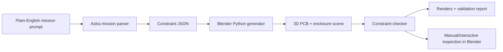

# MissionPCB Product And Build Brief

Last updated: September 8, 2026

## One-Line Pitch

MissionPCB is an AI hardware engineer that generates PCB designs from real-world mission constraints and validates them with simulation before you build.

## Product Thesis

Hardware teams do not only need a faster schematic assistant. They need an engineering system that understands the environment the board must survive in.

Most PCB work fails or slows down when electrical, physical, thermal, RF, sensor, enclosure, battery, and manufacturing constraints collide. Existing AI PCB tools are useful, but they tend to behave like generic copilots inside an EDA workflow. MissionPCB should behave more like an engineer: it interviews the builder, turns requirements into a constraint graph, proposes designs, runs simulations, revises the design, and explains remaining risks.

The positioning should be:

> Not an assistant. Not just a copilot. An AI hardware engineer.

## Target Users

MissionPCB should eventually work across many hardware categories, but the first wedge is high-constraint prototype work where generic PCB help is not enough.

Potential users:

- Student hardware builders
- Robotics and drone builders
- Wearable electronics teams
- Medical or safety-adjacent prototype teams
- Startup electrical engineers
- Small teams without deep EDA/simulation expertise
- Anyone building boards that must fit inside an enclosure or product body

The product should not be framed as only a wearable tool, only a medtech tool, or only a drone tool. Those are examples. The bigger category is mission-constrained PCB generation.

## Problem

Current PCB tooling helps users draw circuits, select parts, route traces, and export manufacturing files. The gap is that real hardware projects usually fail on constraints outside the schematic:

- A component fits on the board but not inside the product enclosure.
- A hot regulator is too close to skin, a battery, or a sensitive sensor.
- A noisy motor driver or switching regulator interferes with RF or sensor signals.
- A battery connector is technically placed but inaccessible after assembly.
- Components that should be separated end up clustered together.
- A design looks fine electrically but fails under environmental, motion, moisture, or thermal stress.
- Teams do not know which failure modes to check until after the board is manufactured.

MissionPCB should make those constraints explicit before layout is finalized.

## Existing Tool Teardown Notes

We walked through Flux, an existing AI PCB design company/tool, using BrowserOS Neo and docs. The high-level consensus:

Flux is a strong AI-assisted EDA workspace. It has AI copilot features, schematic awareness, simulation support, routing/layout rules, manufacturing exports, and FMEA-style analysis. However, its public docs suggest that it is still mostly organized around schematic and PCB workflows rather than a full mission-constraint simulation layer.

Important observed gaps from the teardown:

- Flux simulation is primarily electrical/SPICE-oriented.
- Flux docs explicitly describe simulator limitations around thermal, mechanical, and electromagnetic effects.
- Component placement is still largely a human workflow.
- Layout rules can encode some board constraints, but they do not equal product-level mission reasoning.
- FMEA is useful, but it depends on complete design data and is not a replacement for deeper simulation.

MissionPCB should not compete by saying "we also have AI PCB generation." It should compete by saying:

> We start where PCB tools usually stop: mission constraints, enclosure fit, heat, sensor reliability, RF/noise separation, runtime, and validation before build.

## Product Scope

### Full Product Vision

MissionPCB eventually becomes an end-to-end AI hardware engineering pipeline:

1. User explains the hardware mission in plain English or voice.
2. Agent interviews the user for missing constraints.
3. System builds a structured constraint graph.
4. Parts database supplies dimensions, thermal properties, power draw, voltage/current needs, moisture tolerance, sensor sensitivity, RF behavior, and mounting constraints.
5. Agent generates schematic candidates and board layouts.
6. Simulators validate thermal, electrical, mechanical, RF/noise, battery, environmental, and sensor constraints.
7. Agent revises the design until constraints pass or tradeoffs are explicit.
8. User exports KiCad, Gerber, BOM, pick-and-place, CAD/STL/STEP references, and validation reports.

### Hack Prototype Scope

The hack version should be much narrower:

1. Use Astra to generate a Blender simulation.
2. Show a PCB inside a transparent enclosure.
3. Include separate editable components.
4. Show a bad layout and a corrected MissionPCB layout.
5. Validate only a few simple constraints:
   - fit inside enclosure
   - component height
   - heat zone overlap
   - sensitive/noisy separation
   - connector accessibility
6. Generate a concise validation report.

This proves the core interaction and product thesis without pretending to solve all EDA.

## Meeting-Derived Action Items

Immediate project actions:

- Finalize the MissionPCB product name after reviewing remaining companies.
- Divide build work across simulation, parts data, constraint logic, product/UI, and pitch.
- Build the first parts inventory with real design constraints.
- Build computation logic for component interactions:
  - heat interaction
  - frequency/RF conflicts
  - motor/load noise
  - connector accessibility
  - component separation
  - enclosure fit
- Prepare a lean Astra/Blender simulation demo.
- Prepare testimonials and story material around:
  - medtech/wearable constraints
  - personal drone-building pain
  - Continuity work
  - Synopsys/EDA domain familiarity

Non-product coordination mentioned:

- Set up a LinkedIn group chat for MLE recruiting next year.
- Text friends about the LinkedIn group chat plan.
- Ask Raleigh, the former debate coach, for a connection to Aidan Martin for the McCourt Fellowship referral.

These coordination items are not part of the software build, but they may matter for team momentum and networking.

## Five Focus Domains

These should all appear in the product story, but not all need to appear in the first demo.

1. **Wearables and human-contact hardware**
   - Heat direction, skin safety, comfort, moisture, component placement, battery safety.

2. **Robotics, drones, and embedded systems**
   - Motor noise, current spikes, receiver conflicts, vibration, battery runtime, fast iteration.

3. **Medical and safety-critical prototypes**
   - Sensor reliability, biosignal quality, redundancy, failure reporting, safety margins.

4. **Harsh or variable environments**
   - Temperature, humidity, dust, water exposure, mechanical stress, outdoor operation.

5. **General constraint-first custom hardware**
   - Any board where the environment and mission matter as much as the schematic.

## Core Modules

### 1. Mission Interviewer

The chatbot or voice interface asks the user what they are building and extracts:

- product type
- enclosure dimensions
- operating environment
- budget
- parts preferences
- power source
- runtime target
- thermal limits
- sensor/RF requirements
- safety constraints
- manufacturing/export needs

### 2. Constraint Graph

A structured representation of all hard and soft constraints.

Example nodes:

- component
- enclosure
- battery
- heat source
- sensitive sensor
- noisy component
- RF module
- human-contact surface
- manufacturing rule

Example edges:

- must be at least 20 mm away from
- must stay below 70 C
- must fit inside
- must be accessible from rear opening
- creates switching noise
- creates heat zone
- is sensitive to noise

### 3. Parts Inventory Database

One teammate should focus on this. It should begin as a small structured dataset, not a massive scraped database.

Suggested initial fields:

- part name
- category
- dimensions
- height
- voltage range
- current draw
- heat estimate
- noise level
- sensitivity level
- moisture tolerance
- temperature range
- keep-out radius
- mounting constraints
- connectors/pin count
- compatible use cases
- source URL or datasheet reference

### 4. Interaction Engine

This is the logic that makes MissionPCB more than a layout assistant.

It should compute how components affect each other:

- hot components raise nearby thermal risk
- insulating material changes heat behavior
- regulators create switching noise
- motor drivers create current and EMI risk
- RF modules require keep-out zones
- sensors need distance from heat/noise/vibration
- connectors must remain accessible after enclosure assembly
- battery size and current draw constrain runtime

### 5. Design Generator

For the hack, this can be a scripted/generated scene rather than a real autorouter.

Eventually it should generate:

- schematic candidate
- board outline
- component placement
- trace/routing strategy
- constraints report
- export files

### 6. Simulation Layer

The simulation layer should be the product differentiator.

Near-term:

- 3D mechanical fit
- visual heat/noise zones
- clearance checks
- simplified pass/fail constraint logic

Later:

- SPICE/electrical simulation
- thermal simulation/FEA
- electromagnetic/RF analysis
- battery/runtime simulation
- sensor data simulation
- environmental stress simulation
- manufacturing/DFM checks

### 7. Validation Report

Every generated design should produce a report:

- constraints extracted
- constraints passed
- constraints failed
- measured distances and dimensions
- assumptions
- unresolved risks
- required real-world tests before manufacturing

## Recommended Demo Architecture

Use this architecture for the first build:



## First Build Backlog

### Milestone 1: Static Simulation Artifact

Goal: create a shareable Blender scene that proves the core concept.

Tasks:

- Install Blender on at least one teammate's machine.
- Run the Astra prompt from `prompts/astra-blender-demo-prompt.md`.
- Generate a `.blend` file, two renders, and a validation report.
- Make sure each component is selectable and named.
- Make sure the naive layout fails visibly.
- Make sure the MissionPCB layout fixes or explains the failures.

Definition of done:

- Teammates can open the Blender file and orbit around the board.
- The difference between generic layout and constraint-aware layout is obvious within 10 seconds.
- The validation report has actual measured distances and pass/fail rows.

### Milestone 2: Reusable Constraint Engine

Goal: pull the useful logic out of the generated Blender script.

Tasks:

- Create data structures for components, enclosures, keep-out zones, and constraints.
- Implement distance checks.
- Implement bounding-box checks.
- Implement simplified heat-zone overlap checks.
- Implement RF/sensor/noise separation checks.
- Implement connector-access checks.
- Output structured JSON plus a Markdown report.

Definition of done:

- The same constraint engine can evaluate both naive and optimized layouts.
- Adding a new part does not require rewriting the checker.

### Milestone 3: Parts Inventory Seed

Goal: give the system enough structured metadata to feel real.

Tasks:

- Start from `parts/seed-parts.json`.
- Add 15-30 realistic parts.
- Include dimensions, power, thermal/noise flags, sensitivity, and source links.
- Keep source/datasheet links attached to each part.

Definition of done:

- A teammate can query/select parts by category and constraint.
- The Blender simulation can consume the part metadata.

### Milestone 4: UI Sketch Or Minimal App

Goal: show how the product will feel.

Possible UI:

- Left: chat/voice mission intake.
- Middle: component list and constraint toggles.
- Right: 3D simulation or render preview.
- Bottom: validation report.

Keep this after the Blender proof unless the team has enough people to parallelize.

## Why Blender First

Blender is the right first tool for the hack prototype.

Reasons:

- Astra can generate Blender Python.
- Blender scenes can be inspected interactively.
- Components can remain separate and selectable.
- It supports cameras, renders, animation, labels, overlays, and custom object properties.
- It is free and installable locally.
- It lets us demonstrate mission constraints visually before building a full PCB backend.

Fusion may be useful later for CAD-grade workflows, but it will slow down the first proof. Use Fusion later for CAD import/export, mechanical collaboration, and enterprise workflows.

## Does The Team Need Blender?

Yes, at least one person should install Blender locally if we want real interactive inspection.

Astra can write Blender Python without Blender, but it cannot truly verify that the scene opens, renders, and works interactively unless Blender exists in the environment it can access.

On macOS:

```bash
brew install --cask blender
```

Fallback:

- Download from https://www.blender.org/download/

## Astra Build Strategy

Do not ask Astra for a single final 3D file. Ask it to run an engineering loop:

1. Check whether Blender is installed.
2. Generate a Blender Python script.
3. Run Blender with the script.
4. Save a `.blend` file.
5. Render preview images.
6. Inspect the output with computer use if available.
7. Fix geometry, labels, cameras, overlays, and object names.
8. Render final images.
9. Produce a validation report.

Key prompting rules:

- Specify scale and units.
- Keep objects separate, named, editable, and selectable.
- Use simple primitives first.
- Build the static scene before animation.
- Require exact measurable constraints.
- Require a validation report.
- Ask for self-verification and rerendering.
- Tell Astra not to claim real physics unless it actually implements the solver.

## Research Notes And Sources

OpenAI's Astra architectural visualization writeup showed the useful pattern for this project: Astra can generate Blender Python, run Blender in the background, inspect rendered outputs, revise geometry, and export usable 3D artifacts. That supports using Astra as the orchestrator and simulation-script generator, while Blender provides the actual 3D environment.

Community/Reddit takeaways:

- People reporting good Astra 3D results generally use Blender scripting or Blender MCP-style workflows.
- The better prompts split complex scenes into named editable parts.
- The model should be asked to inspect and fix its own output instead of stopping after code generation.
- Organic/highly realistic modeling is less reliable than structured engineering geometry.
- First-pass scenes can look impressive but still have geometry, scale, topology, or labeling errors, so verification matters.

Useful source links:

- OpenAI Astra architectural visualization: https://developers.openai.com/blog/architectural-visualization-with-astra
- Blender Python API docs: https://docs.blender.org/api/current/
- Blender command-line docs: https://docs.blender.org/manual/en/latest/advanced/command_line/arguments.html
- Blender download: https://www.blender.org/download/
- KiCad docs: https://docs.kicad.org/
- Flux docs: https://docs.flux.ai/

## Lean Astra Prompt

Use this as the first prompt to Astra.

```text
You are GPT-6 Astra acting as MissionPCB's 3D simulation engineer.

My goal:
Build a lean but impressive interactive Blender simulation for MissionPCB, an AI hardware engineer that generates PCB designs from real-world mission constraints and validates them with simulation before build.

This is not a full production PCB solver yet. This is the first generic simulation demo: a 3D product enclosure with a PCB and movable/editable components, showing physical fit, heat zones, sensitive/noisy component separation, and a simple constraint validation dashboard.

Important:
Do not just describe what to do. Actually do the work end-to-end using the tools available to you. Use shell, filesystem, Blender Python, Blender MCP, and/or computer use if available. If Blender is installed, open/control it and build the scene. If Blender is not installed, first check whether you can install or guide installation. Ask me only if you hit a permission/download blocker.

First inspect the environment:
1. Check whether Blender is installed:
   - macOS: check /Applications/Blender.app
   - shell: try blender --version
   - shell: try /Applications/Blender.app/Contents/MacOS/Blender --version
2. Check whether you can run Blender scripts from the command line.
3. Check whether Blender MCP or computer use access to Blender is available.
4. Report briefly what path you will use:
   - Preferred: Blender Python script + open Blender for interactive inspection
   - Also acceptable: Blender background --python render pipeline plus saved .blend
   - Fallback: generate the Python script and tell me exactly how to run it

If Blender is missing:
- On macOS, if you have shell permission and Homebrew exists, install with: brew install --cask blender
- If Homebrew is unavailable or install permission is blocked, tell me I need to manually install Blender from blender.org.
- Do not fake verification if Blender is missing.

Best-practice instructions:
- Build with Blender Python (bpy) instead of manually clicking every object into existence.
- Keep every object separate, named, selectable, and editable.
- Use exact dimensions and units.
- Split the model into clear parts instead of one giant object.
- Create a first version, render preview images, inspect them, then fix problems.
- Use simple geometric primitives for the first demo, not organic/realistic shapes.
- Avoid overcomplicated animation until the static scene is correct.
- Prefer engineering clarity over cinematic complexity.
- Make all constraints visible and measurable.
- Do not claim real FEA, SPICE, RF, or thermal physics unless actually implemented.
- Label simplified approximations clearly.

Deliverables:
Create a folder named missionpcb_blender_demo.
Inside it, create:
1. missionpcb_lean_constraint_demo.blend
2. build_missionpcb_demo.py
3. validation_report.md
4. renders/top_down.png
5. renders/isometric.png
6. Optional if feasible: renders/constraint_walkthrough.mp4

Scene concept:
Create a clean 3D engineering scene showing two versions of the same PCB inside a transparent enclosure:
- Left side: Naive Layout, a messy first-pass board with visible failures.
- Right side: MissionPCB Layout, the corrected board after MissionPCB understands fit, heat, and separation.

Use millimeters as the working unit.

Product enclosure:
- Interior length: 90 mm
- Interior width: 50 mm
- Interior height: 18 mm
- Wall thickness: 2 mm
- Transparent smoky gray material
- Top shell semi-transparent
- Rear access opening for the battery connector
- Red translucent 3 mm wall keep-out margin

PCB:
- Size: 72 mm x 38 mm x 1.6 mm
- Green solder mask
- Small rounded corners if feasible
- Thin copper-colored pads/traces for visual clarity
- Name objects PCB_Naive and PCB_MissionPCB

Components:
Create each component as a separate named object on each board:

1. MCU
- 12 x 12 x 2 mm
- dark blue/black
- label MCU
- should stay near board center

2. Sensor
- 6 x 6 x 1.5 mm
- cyan
- label SENSOR
- should stay near center
- must be at least 15 mm from hot components
- must be at least 18 mm from noisy components

3. RF Module
- 16 x 10 x 2 mm
- purple
- label RF
- must be at least 20 mm from noisy components
- add translucent purple antenna keep-out zone extending 22 mm from one side

4. Power Regulator
- 8 x 8 x 3 mm
- orange
- label REG
- hot and noisy
- add orange translucent heat/noise zone with 18 mm radius

5. Driver / Load Component
- 14 x 10 x 3 mm
- red
- label DRIVER
- hot and noisy
- add red translucent heat/noise zone with 22 mm radius

6. Battery Connector
- 10 x 6 x 5 mm
- yellow/gold
- label BATT
- must be near rear access opening

Naive Layout:
- Place Sensor too close to Driver.
- Place RF too close to Regulator.
- Cross RF antenna keep-out zone with a visible trace/wire.
- Let Driver heat zone overlap Sensor.
- Put Battery connector away from rear opening.
- Show red warning lines and red X markers.
- Dashboard should show FAIL rows.

MissionPCB Layout:
- Move Sensor near center but outside heat/noise zones.
- Move RF away from Regulator and Driver.
- Put Battery connector near rear access opening.
- Put Driver and Regulator closer to board edges.
- Keep high-current trace away from RF antenna zone.
- Show green lines/checks for passed constraints.

Constraint logic:
Write actual Python calculations for:
- component bounding boxes
- center-to-center distances
- height checks against 14 mm max component height above PCB
- wall keep-out checks
- sensor distance from hot/noisy components
- RF distance from noisy components
- battery connector rear accessibility
- simplified RF antenna keep-out overlap

Use those calculations to produce:
- red/green relationship lines
- red X / green check markers
- text labels with distances in mm
- Markdown validation report

Interactivity:
- Every component must be individually selectable.
- Objects must not be joined into one mesh.
- Objects must have clean outliner names.
- Add collections:
  - 00_Reference
  - 01_Naive_Layout
  - 02_MissionPCB_Layout
  - 03_Constraint_Overlays
  - 04_Cameras_Lights
- Add custom properties to components:
  - component_type
  - heat_source
  - noise_source
  - sensitive
  - required_clearance_mm
- Add scene text: "Orbit, zoom, and select individual components. Move parts to inspect constraints."
- If feasible, create a helper function named recalculate_constraints() that recomputes pass/fail after moving a component.

Cameras and renders:
- Camera_TopDown
- Camera_Isometric
- Camera_CloseConstraint
- Render top_down.png and isometric.png at 1920x1080.
- Use enough lighting to see through the enclosure.
- Use Eevee or Cycles, whichever is more reliable.

Validation report:
Create validation_report.md with:
- Blender version
- files created
- component positions
- constraints measured
- pass/fail table
- simplified-model disclaimer
- next steps for real thermal, electrical, RF, KiCad, and enclosure import

Self-verification loop:
After creating the first scene:
1. Render a quick preview.
2. Inspect the render or open Blender through computer use if possible.
3. Check for hidden components, bad labels, wrong scale, missing objects, merged parts, unreadable dashboards, and confusing overlays.
4. Fix the scene.
5. Render final top-down and isometric images.
6. Save the .blend.

Success criteria:
The task is complete only when:
- A Blender file exists.
- The scene opens correctly.
- The user can orbit/zoom/select individual components.
- Naive layout visibly fails constraints.
- MissionPCB layout visibly passes or explains remaining failures.
- Top-down and isometric renders exist.
- Validation report exists.
- You inspected the output and fixed obvious issues.

Start now.
```

## Follow-Up Prompt If Astra Stops Early

```text
Continue executing. Do not stop at a plan or script.

Your current priority order is:
1. Make the Blender scene actually exist.
2. Make it openable and inspectable.
3. Make all PCB parts separate, named, editable objects.
4. Render proof images.
5. Fix visual or geometry issues after inspection.
6. Produce the validation report.

If you already wrote Python code, run it through Blender now.

Use the most direct working command available:
- blender --background --python build_missionpcb_demo.py
- /Applications/Blender.app/Contents/MacOS/Blender --background --python build_missionpcb_demo.py

If command-line Blender fails, diagnose why, fix the cause, and retry.

After the .blend file is created, open it in Blender if possible. Use computer use if available. Inspect whether both layouts, overlays, labels, dashboard, and selectable components work. If anything is wrong, modify the script and regenerate the scene.

When finished, report:
- Blender installed? yes/no
- Blender version
- exact files created
- exact commands run
- what you inspected
- what passed
- what remains approximate
```

## Division Of Work

Recommended teammate split:

1. **Astra/Blender simulation owner**
   - Run the prompt.
   - Get the `.blend`, renders, and validation report working.
   - Make sure objects are editable and visible.

2. **Parts database owner**
   - Build the initial structured component dataset.
   - Start with 15-30 parts, not a giant database.
   - Include dimensions, power, thermal/noise flags, sensitivity, and source links.

3. **Constraint logic owner**
   - Implement distance, bounding-box, keep-out, heat-zone, and connector-access checks.
   - Keep the logic solver-independent at first.

4. **Product/UI owner**
   - Sketch the future interface:
     - chat/voice intake
     - constraint toggles
     - drag-and-drop component view
     - simulation pane
     - validation report

5. **Pitch/product framing owner**
   - Keep the story tight:
     - generic PCB tools help you draw
     - MissionPCB helps you engineer against mission constraints
     - simulation before build is the wedge

## Suggested Repo Structure

```text
.
├── README.md
├── docs/
│   └── missionpcb-product-build-brief.md
├── prompts/
│   └── astra-blender-demo-prompt.md
├── parts/
│   └── seed-parts.json
├── simulations/
│   └── missionpcb_blender_demo/
└── src/
    └── constraint_engine/
```

## Next Technical Steps

1. Install Blender locally.
2. Run the Astra prompt.
3. Commit the generated Blender script and validation report.
4. Add a small seed parts dataset.
5. Turn the prompt's constraint logic into reusable Python functions.
6. Build a minimal web UI only after the simulation works.
7. Add KiCad/Gerber export later.

## Risks And Honest Limits

The prototype should be explicit about what is real and what is approximate.

Real in the demo:

- 3D layout
- object dimensions
- enclosure fit
- selectable components
- distance checks
- simple keep-out checks
- visual heat/noise zones
- validation report

Approximate in the demo:

- heat behavior
- RF/noise behavior
- battery/runtime unless implemented separately
- manufacturability
- actual PCB routing correctness

Not included yet:

- full autorouting
- SPICE simulation
- thermal FEA
- electromagnetic simulation
- manufacturing DFM
- verified KiCad export

## Product North Star

MissionPCB should make hardware iteration feel more like coding with tests.

The user should be able to say what they want to build, and MissionPCB should generate a board candidate, run mission-specific checks, explain failures, revise the design, and produce the evidence needed to decide whether the design is ready for the next build step.
