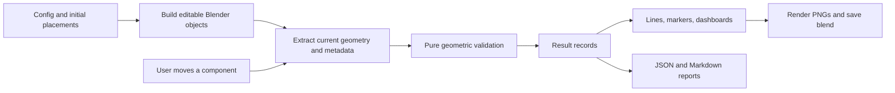

# MissionPCB Blender demo — technical design and execution plan

Date: September 8, 2026. Status: planning only; no scene implementation or installation performed.

## 1. Outcome and scope

Build a reproducible, editable Blender demonstration comparing a deliberately flawed PCB layout with a corrected layout inside identical electronics enclosures. Actual geometric calculations must drive the visible relationships, seven dashboard rows, and validation report.

The deliverable demonstrates how mission constraints can inform hardware placement. The initial placements are explicitly authored demonstration fixtures, not the output of an AI optimizer. Moving a component and recalculating will produce new results from its actual geometry. Automatic placement, electrical correctness, manufacturing readiness, and physically simulated heat or RF propagation are outside this first version.

Required completion artifacts:

- `missionpcb_blender_demo/missionpcb_lean_constraint_demo.blend`
- `missionpcb_blender_demo/build_missionpcb_demo.py`
- `missionpcb_blender_demo/validation_report.md`
- `missionpcb_blender_demo/renders/top_down.png`
- `missionpcb_blender_demo/renders/isometric.png`

The eight-second video is a separate optional milestone after the static scene and interaction pass verification.

## 2. Environment already inspected

| Item | Observed state | Consequence |
|---|---|---|
| Workspace | `/Users/dhruvavutukury/Documents/ChatGPT/astra 2` | All project artifacts live here |
| Git | Empty local `main`; origin is `https://github.com/shivanshb828/astra-hack.git` | No existing application to preserve or integrate |
| Project instructions | No `AGENTS.md` found in workspace or inspected ancestor directories | No additional repository rules discovered |
| Machine | Apple Silicon `arm64`, macOS 15.6, 16 GiB memory | Use native Apple Silicon Blender |
| Blender | Absent from PATH, `/Applications`, and `~/Applications` checks | Install before any Blender execution or verification |
| Homebrew | `/opt/homebrew/bin/brew` available | Preferred installation path |
| Blender cask | Homebrew metadata lists 5.2.1, Apple Silicon download; not installed | Candidate version, not a tested runtime |
| Python | `/opt/homebrew/bin/python3` available | Pure geometric planning and later unit tests |
| FFmpeg | Not found on PATH | Optional animation encoding needs a later capability check |
| Free disk | Approximately 8.9 GiB at inspection | Recheck before installation; prioritize stills and bounded previews |
| Blender MCP | No callable Blender-specific tool exposed | Do not add an MCP dependency |
| Computer use | Native-app control tools exposed | GUI inspection planned after installation; actual Blender control untested |

No Blender script, render, viewport interaction, or `.blend` opening has been verified yet. Only environment inspection and scratch arithmetic supporting the proposed placements have run.

## 3. Approach and tradeoffs

| Approach | Advantages | Costs | Decision |
|---|---|---|---|
| Blender Python generation, saved scene, GUI inspection | Exact dimensions, deterministic rebuilds, native editing, visual proof | Requires Blender installation and a small runtime helper | Recommended |
| Background-only build and renders | Automated geometry and image output | Cannot alone prove comfortable selection/orbit interaction | Operational fallback if GUI access fails |
| Browser viewer or custom web application | Easy future sharing | Duplicates renderer and interaction work; does not satisfy the native Blender deliverable alone | Future phase |

Use Blender's bundled Python and standard-library modules. No backend, database, API keys, paid services, external component assets, pip-installed `bpy`, or external fonts are needed. A small Blender sidebar panel is worth including, but the plain `recalculate_constraints()` function remains the dependable fallback.

## 4. Proposed repository structure

```text
docs/
  missionpcb-technical-plan.md
missionpcb_blender_demo/
  README.md
  build_missionpcb_demo.py       # CLI orchestration; build/recalculate/render modes
  scene_config.json             # dimensions, metadata, rules, seed placements, trace paths
  constraints.py               # pure geometry and rule evaluation; no bpy imports
  scene_builder.py             # static geometry, materials, collections, cameras
  overlays.py                  # result-driven relationships, markers, dashboards
  runtime.py                   # Blender geometry extraction, recalc, sidebar registration
  tests/
    test_constraints.py        # numerical boundaries, fixtures, geometry changes
    verify_blend.py            # Blender integration and saved-file checks
  missionpcb_lean_constraint_demo.blend
  validation_report.md
  validation_results.json      # unrounded machine-readable results
  build_manifest.json          # provenance, settings, file hashes, verification state
  renders/
    top_down.png
    isometric.png
    previews/                  # bounded, disposable review images
    evidence/                  # selection/viewport screenshots if GUI verification succeeds
    constraint_walkthrough.mp4 # optional
  logs/                        # generated command output, ignored by Git
.gitignore
```

The CLI entrypoint is the only command users need to build. Supporting files keep the geometry rules inspectable without starting Blender. The `.blend` embeds the runtime, rule, and overlay source in named Text datablocks so recalculation can work when the file is moved away from the repository. A small embedded bootstrap loads those named modules in dependency order; test that bootstrap in a fresh Blender process with the source directory unavailable.

Store primitive assets and Blender's built-in font in the scene; avoid absolute external resource dependencies. Resolve output paths from an explicit CLI argument or project directory, never the caller's arbitrary working directory.

## 5. Coordinate system and mechanical geometry

**Canonical values are millimeters.** Configure Blender as metric with `scale_length = 0.001` and millimeter display; one modeled Blender unit represents one millimeter. Geometry is authored directly using values such as 72, 38, and 1.6. Document this explicitly for later CAD export. Blender exposes unit conversion settings through its [UnitSettings API](https://docs.blender.org/api/5.0/bpy.types.UnitSettings.html).

Each layout has an unscaled root Empty. All engineering measurements use that root's local coordinate system; presentation offsets never enter the calculations. Initial presentation positions are approximately X = -64 mm and +64 mm. Roots remain locked against accidental editing.

| Feature | Exact convention |
|---|---|
| Axes | X = enclosure length; Y = width; Z = height |
| Front / rear | Front is negative X; rear opening faces positive X |
| Interior | X `[-45,45]`, Y `[-25,25]`, Z `[0,18]` |
| Walls | 2 mm outside the interior; external X/Y size 94 × 54 mm |
| Floor and lid | Floor Z `[-2,0]`; lid Z `[18,20]` |
| Wall margin | 3 mm laterally inside the four interior walls; permitted solid footprint X `[-42,42]`, Y `[-22,22]` |
| PCB | 72 × 38 × 1.6 mm, centered X/Y; bottom Z = 2, top Z = 3.6 |
| PCB corners | 1 mm rounded outline, kept inside the specified overall dimensions |
| Placement edge margin | Component footprints stay 1 mm inside rectangular PCB bounds; this conservatively avoids the rounded corners |
| Maximum component height | Top must be no more than 14 mm above PCB top; independent enclosure-ceiling check also runs |
| Rear opening | Wall opening at X `[45,47]`, Y `[-5,5]`, Z `[3,11]`; 10 mm wide × 8 mm high |
| Connector orientation | Mating direction points along positive X |

Make walls, floor, lid, PCB, components, and references separate objects. Construct the rear wall from simple segments around the opening, avoiding a fragile Boolean cut. Use optional simple supports under the board, tagged as mechanical solids. Their only permitted contact is the underside of the PCB.

The wall-margin overlay is a lateral placement envelope, not a requirement for 3 mm of clearance above and below every component. Vertical limits are separate; this avoids contradicting the 14 mm rule and 18 mm interior.

## 6. Components, properties, and seeded placements

Use the exact component sizes and flags from the brief. Component mesh origins are their body centers; all initial bottoms sit at Z = 3.6 mm. Dimensions include the envelope that is actually checked; decoration cannot silently enlarge a package.

| Component | Size X × Y × Z mm | Type | Heat / noise / sensitivity | Naive center X,Y | Corrected center X,Y | Center Z |
|---|---|---|---|---|---|---|
| MCU | 12 × 12 × 2 | processor | false / false / medium | 0, -10 | -2, -9 | 4.6 |
| SENSOR | 6 × 6 × 1.5 | sensor | false / false / high | 5, 0 | -2, 4 | 4.35 |
| RF | 16 × 10 × 2 | wireless | false / false / high | -20, 9 | -27, 10 | 4.6 |
| REG | 8 × 8 × 3 | power_regulator | true / true / low | -5, 10 | 29, 9 | 5.1 |
| DRIVER | 14 × 10 × 3 | driver | true / true / low | 18, -4 | 27, -10 | 5.1 |
| BATT | 10 × 6 × 5 | connector | false / false / low | -28, -11 | 30, 0 | 6.1 |

Colors: MCU nearly black/navy, sensor cyan, RF purple, regulator orange, driver red, connector gold, PCB green, pads/traces copper.

Names use stable identifiers such as `MCU_Naive`, `Sensor_Naive`, `RF_MissionPCB`. Board names are exactly `PCB_Naive` and `PCB_MissionPCB`. Read logic by custom properties and IDs rather than fragile display labels or Blender selection order.

Properties include `component_id`, `layout_id`, `component_type`, `heat_source`, `noise_source`, `sensitive`, nominal dimensions, relevant separation thresholds, heat-zone radius, connector direction, and antenna-axis/length. Config changes must produce the same serialized values on scene objects.

Define the otherwise ambiguous placement goals as demo policies: sensor center within 12 mm of PCB center, MCU within 15 mm. Include these diagnostics under mechanical placement. Both fixtures pass these policies. Corrected driver/regulator nearest board-edge distances are 2 mm and 3 mm respectively; edge preference is descriptive, not a new hard threshold.

Scratch arithmetic confirmed both proposed fixtures have no positive-area component-body overlaps and all bodies lie inside the board. These are planning results, not Blender verification.

## 7. Constraint model and exact rule meanings

The engine receives a scene snapshot expressed in millimeters. Each result contains rule ID, category, layout ID, subject IDs, numeric measurement, units, threshold/operator, status, explanation, and overlay anchors. Both per-pair details and seven category summaries derive from this same result set.

Category aggregation: PASS only when all applicable checks pass. A missing object, invalid transform, missing conductor metadata, or unavailable bounding box produces ERROR/incomplete evaluation, never a green PASS. An expected engineering FAIL in the naive fixture is not a program execution failure.

Use a numerical tolerance of `1e-6` mm for arithmetic comparisons and display distances rounded to 0.1 mm. Never determine status from rounded display text. Mounting contact has a separate explicit ±0.05 mm tolerance.

**Geometry extraction.** Transform all eight evaluated object bounding-box corners into layout-local space, then compute min/max coordinates. Blender's [Object API](https://docs.blender.org/api/current/bpy.types.Object.html?highlight=ray) defines these bounding-box coordinates in object space, so reading them directly would be incorrect after moving or rotating objects. Exclude labels and overlays from physical envelopes. Re-read actual mesh geometry and transforms at recalculation, not original seed positions.

Use XY projected center distances for heat/noise placement rules. Raising a sensor in Z must not bypass a PCB separation requirement. AABBs conservatively handle Z-axis rotation; arbitrary rotated outlines can over-report collisions and must be identified as approximate. Tilting parts away from the PCB plane or moving their bottoms off the board fails mounting validity. Scaling updates measured dimensions; zero scale, non-finite coordinates, and unavailable geometry yield errors.

| Dashboard category | Actual calculation | Pass rule |
|---|---|---|
| Mechanical fit | PCB/enclosure bounds, component-to-PCB containment, lateral wall clearance, component AABB collisions, mounting, center policies | PCB/solids inside bounds; lateral clearance ≥3 mm; component board margin ≥1 mm; no body interpenetration; mounting and center policies satisfied |
| Component height | For each body, maximum Z minus current PCB top; also actual ceiling clearance | Height ≤14 mm and no ceiling penetration |
| Sensor heat separation | Sensor-to-each-hot-source XY center distance; source-center-to-sensor-footprint distance for drawn heat disk | Center distance ≥15 mm AND sensor footprint clear of each disk: ≥18 mm for REG, ≥22 mm for DRIVER |
| Sensor noise separation | Sensor-to-each-noisy-source XY center distance | Each ≥18 mm |
| RF noise separation | RF-to-each-noisy-source XY center distance | Each ≥20 mm |
| RF antenna keep-out | Rectangular keep-out against conductive component envelopes and tagged copper/wire segments | No touch or overlap with foreign conductor envelope, including trace width |
| Battery connector access | Rear-facing body edge distance, Y/Z alignment, facing direction, and straight insertion corridor | Rear gap ≤12 mm, projected body fits opening, direction within 5° of +X, corridor clear |

Mechanical bodies that merely touch within numerical tolerance do not count as interpenetrating; mounting contact is intentional. RF keep-out boundary contact is a violation because conductors are forbidden in that region. Test the distinct boundary conventions explicitly.

### Heat and noise display

REG has a radius-18 mm orange disk; DRIVER has a radius-22 mm red disk. These are conservative illustrative influence zones, not temperatures or electromagnetic field strengths. A sensor footprint must clear the disks in addition to satisfying the specified center-distance thresholds. This resolves the brief's requirement that the sensor be visibly outside the heat zones: merely satisfying 15 mm would not be enough.

For a source center `(cx,cy)` and axis-aligned sensor footprint `[xmin,xmax] × [ymin,ymax]`, compute `dx=max(xmin-cx,0,cx-xmax)`, `dy=max(ymin-cy,0,cy-ymax)`, and `sqrt(dx²+dy²)`. Compare that distance to the source's zone radius. Report both this margin and center distance.

### RF keep-out and traces

Orient the RF antenna toward negative X. The rectangular exclusion extends 22 mm outward from the RF body's negative-X face and spans its 10 mm width. It remains parented to the RF module and is recomputed from the current module transform.

In the corrected fixture, it occupies X `[-57,-35]`, Y `[5,15]`. It intentionally extends through and beyond a **nonconductive polymer enclosure**. The air outside the enclosure is allowed; the enclosure is explicitly not a metal housing. FR-4 without copper is allowed. Conductive bodies, copper segments, wires, and optional metal fixtures are checked. The RF module itself is excluded from its own check. A future metal enclosure changes this policy and may invalidate the layout.

In the naive fixture, the zone is X `[-50,-28]`, Y `[4,14]`. Route a visible 0.6 mm high-current trace from BATT via `(-31,-11) → (-31,16) → (-5,16) → REG`; the vertical segment at X=-31 crosses the antenna region while remaining on the PCB. Continue an illustrative power path toward DRIVER without claiming electrical routing correctness.

For the corrected fixture, route high-current copper locally among BATT, REG, and DRIVER on the positive-X end of the board; its envelope stays far from X≤-35. Use individual straight segment objects with width metadata. Transform conductor bounds into the RF frame and run rectangle-overlap tests with half-width expansion. Conservative AABBs for diagonal segments are acceptable and documented; do not use one large box around an entire bent path.

Decorative copper is also tagged and checked, or kept absent from the exclusion zone. Do not draw unmodeled ground planes under the antenna. Each trace is visibly illustrative: no netlist, pin mapping, impedance, clearance-rule coverage, or continuity guarantee is implied.

### Battery access

The corrected connector spans X `[25,35]`, Y `[-3,3]`, Z `[3.6,8.6]`. Its rear edge is 10 mm from the inner rear wall. Its projection fits the 10 × 8 mm opening.

Check a straight insertion corridor from connector rear face through the outside of the rear wall. Expand the connector projection by 1 mm sideways and 1 mm upward: corrected corridor Y `[-4,4]`, Z `[3.6,9.6]`. Check other component/fixture AABBs against this corridor; permit the target connector and intended board-surface contact. It is a simplified accessibility test, not a cable bend-radius or detailed connector-mating simulation.

The naive connector has a 68 mm rear gap and an 11 mm Y offset, so it fails on measurable placement grounds.

## 8. Expected numerical comparison

Values below are predictions calculated from the proposed coordinates. Actual Blender results must independently agree before completion.

| Measurement | Naive | MissionPCB | Rule |
|---|---:|---:|---|
| Sensor → DRIVER center | 13.601 mm | 32.202 mm | ≥15 mm heat; ≥18 mm noise |
| Sensor → REG center | 14.142 mm | 31.401 mm | ≥15 mm heat; ≥18 mm noise |
| DRIVER center → sensor footprint | 10.050 mm | 28.231 mm | ≥22 mm |
| REG center → sensor footprint | 9.899 mm | 28.071 mm | ≥18 mm |
| RF → REG center | 15.033 mm | 56.009 mm | ≥20 mm |
| RF → DRIVER center | 40.162 mm | 57.585 mm | ≥20 mm |
| Maximum component height | 5 mm | 5 mm | ≤14 mm |
| Connector rear gap | 68 mm | 10 mm | ≤12 mm |
| Sensor center offset | 5 mm | 4.472 mm | ≤12 mm demo policy |
| MCU center offset | 10 mm | 9.220 mm | ≤15 mm demo policy |

Expected seven-row dashboards:

| Category | Naive | MissionPCB |
|---|---|---|
| Mechanical fit | PASS | PASS |
| Component height | PASS | PASS |
| Sensor heat separation | FAIL | PASS |
| Sensor noise separation | FAIL | PASS |
| RF noise separation | FAIL | PASS |
| RF antenna keep-out | FAIL | PASS |
| Battery connector access | FAIL | PASS |

The naive scene need not fail every category. It should demonstrate specific failures without artificial geometry collisions. Never special-case the layout name to force these results.

## 9. Scene presentation and cameras

Create the requested top-level collections exactly:

```text
00_Reference
01_Naive_Layout
02_MissionPCB_Layout
03_Constraint_Overlays
04_Cameras_Lights
```

Nested collections group bodies, shells, trace segments, labels, and each layout's overlays. Each of the twelve component bodies remains a separately selectable mesh. Parent component labels to their body; regeneration moves annotations without deleting user-edited bodies. Disable selection on overlays and transparent shell by default so clicks can reach components; the shell remains a separate editable Outliner object whose selection can be re-enabled.

Use a neutral engineering background, subtle 5 mm grid, coordinate axes, a labeled 10/20/50 mm ruler, and a faint front-to-rear airflow arrow. Board-outline labels state `72 × 38 × 1.6 mm`. The airflow arrow is a directional assumption, not a CFD result.

Use smoky transparent walls, a very faint separate lid, visible edge outlines, and shallow low-opacity disks. Overlay material priority and Z offsets must avoid z-fighting and prevent large translucent disks from hiding components. Keep overlays at defined shallow elevations above the highest body, with short leader ticks indicating actual anchors where needed. Distances are calculated in XY even when display lines are offset upward.

Relationship lines identify relevant failed or passed pairs. Combine duplicate sensor heat/noise relationships into one label with both thresholds where this prevents clutter; the report retains separate rule results. RF-to-REG, RF-to-DRIVER, sensor-to-hot/noisy pairs, and connector access have clear anchors. Add geometric red X and green check markers rather than relying on font support for symbols. PASS/FAIL text accompanies color.

Both floating dashboard panels show the exact title `MissionPCB Constraint Check`, seven rows, a short reason, critical measured value, and threshold. Place panels next to or immediately below their associated board without covering the geometry. Use approximately 140 × 46 mm starting panel size and target at least 18–22 rendered pixels for body text at 1920×1080. Adjust camera framing and panel size after the first actual render; readability is an acceptance criterion.

Required instruction text:

> Orbit, zoom, and select individual components. Move parts to inspect how constraints would change.

Add a nearby concise instruction: `Results are a snapshot. Recalculate after edits.`

Camera plan:

- `Camera_TopDown`: orthographic along negative Z; symmetric overview of both layouts and both panels.
- `Camera_Isometric`: orthographic or low-distortion perspective; view from the positive-X, negative-Y, positive-Z side so rear openings remain visible.
- `Camera_CloseConstraint`: close view of the naive sensor/driver or RF/trace failure, with its measured label readable.

Use world-space billboards facing the active render camera for dashboard and distance text. Reorient them explicitly before each render; do not depend on a handler firing correctly. Component labels can lie on top faces. The saved file uses the isometric presentation; free orbit remains available, and the sidebar provides a view-independent constraint readout.

## 10. Build, data flow, and interactive behavior



Functions and modes:

- `build_scene(config)`: builds the two layout fixtures and presentation geometry.
- `extract_scene_snapshot()`: reads evaluated bodies, board planes, trace envelopes, access opening, metadata, and layout transforms.
- `evaluate_constraints(snapshot)`: returns detailed results and category aggregation without using Blender.
- `recalculate_constraints()`: updates dependency evaluation, extracts current geometry, evaluates rules, replaces generated overlays, and stores a new result snapshot. It must not reset placements.
- CLI `--mode build`: builds from config in a fresh/factory scene.
- CLI `--mode recalculate`: loads an existing `.blend` and refreshes results without rebuilding bodies.
- CLI `--mode render`: recalculates, configures each camera, renders, and saves the consistent final state.

Rebuilding is explicit. Running recalculation never replaces components with the original fixture coordinates. Scope all cleanup by generated object tags; do not delete unrelated scene objects. Running overlay refresh twice must not create `.001` duplicates or steadily grow material/text datablocks.

Sidebar tab: `MissionPCB`. Controls: Recalculate Constraints, show/hide shell, show/hide influence zones, and switch among three cameras. Include result freshness, measured dimensions of the selected component, and the seven-row summary.

On reopening, Blender can display and edit the scene without running scripts. Activating the sidebar requires explicitly running the embedded `runtime.py` Text block once per session, or opening Blender with the documented runtime startup argument. Do not assume custom Python class registrations persist in the saved file. Do not globally change Blender's script trust settings.

After runtime activation, a lightweight GUI timer checks only relevant geometry/metadata signatures roughly twice per second. On a change, mark results STALE and gray/hide prior relationship overlays until Recalculate is clicked. Do not continuously rebuild the scene while a component is dragged. Suspend the timer during rendering and unregister it on unload/re-registration. Without runtime activation, the permanent snapshot notice remains the honest behavior.

Prefer explicit operations and a guarded GUI timer over mutation from dependency-graph or render handlers. Blender documents [risks when handlers alter data accessed by the viewport](https://docs.blender.org/api/4.0/bpy.app.handlers.html) and provides [timer registration/unregistration](https://docs.blender.org/api/4.5/bpy.app.timers.html).

A failed recalculation shows ERROR and clears current-validity claims. Report export failure is reported separately from geometric status; the UI must not claim a report was saved when the output directory is unwritable. Recalculation updates in-memory results; exporting results and saving user edits are explicit actions. Avoid silently saving over a user's edited file on every click.

## 11. Installation and rendering logistics

Execution begins only after the planning stage is accepted or the user directs implementation.

1. Recheck available disk and cask metadata. Install using `brew install --cask blender`; use the native Apple Silicon build. Do not remove user files to make space.
2. Verify the actual installed Blender version and bundled Python. Record them in the environment manifest.
3. Run a background Python smoke test, then a tiny render. Command-line availability alone does not prove rendering works.
4. Prefer Eevee. Detect available engine identifiers at runtime: Blender 5.0 renamed `BLENDER_EEVEE_NEXT` to `BLENDER_EEVEE`, according to its [Python release notes](https://developer.blender.org/docs/release_notes/5.0/python_api/). Do not copy obsolete 4.x material or ambient-occlusion properties blindly into 5.x code.
5. Probe supported transparency/material APIs. Use simple alpha/transparency nodes with low shadow influence; if Eevee transparency remains unreadable, first simplify overlapping translucent surfaces, then test Cycles.
6. Use Cycles CPU as the reliability fallback. Metal acceleration is an optional measured improvement, not a prerequisite or assumption.
7. Render draft previews at 960×540 with modest sampling. Inspect both cameras before spending time on final 1920×1080 PNGs.
8. Recalculate before rendering. Save the scene and export the report from the same validated geometry revision.

Use three area lights or similarly simple broad illumination, a neutral world, a fixed color-management setting, and no external HDRI. Tune lighting empirically for the chosen millimeter scale. Ambient occlusion is enabled only through settings supported by the installed version.

Render all outputs through the build entrypoint to control argument ordering and freshness. Use `--python-exit-code 1` to surface script failures to the shell; Blender documents it among [command-line Python options](https://docs.blender.org/manual/id/4.0/advanced/command_line/arguments.html). Return a nonzero process code for execution/integrity failures or unexpected corrected-layout failures, while expected naive-layout FAILs remain successful demo output.

Planned commands, run from the repository root after the scripts exist:

```bash
brew install --cask blender

/Applications/Blender.app/Contents/MacOS/Blender --version

python3 -m unittest discover -s missionpcb_blender_demo/tests -p 'test_*.py' -v

/Applications/Blender.app/Contents/MacOS/Blender \
  --background --factory-startup --python-exit-code 1 \
  --python missionpcb_blender_demo/build_missionpcb_demo.py -- \
  --mode build --quality preview

/Applications/Blender.app/Contents/MacOS/Blender \
  --background missionpcb_blender_demo/missionpcb_lean_constraint_demo.blend \
  --python-exit-code 1 \
  --python missionpcb_blender_demo/tests/verify_blend.py

/Applications/Blender.app/Contents/MacOS/Blender \
  --background missionpcb_blender_demo/missionpcb_lean_constraint_demo.blend \
  --python-exit-code 1 \
  --python missionpcb_blender_demo/build_missionpcb_demo.py -- \
  --mode render --quality final

open -a Blender missionpcb_blender_demo/missionpcb_lean_constraint_demo.blend
```

These are planned commands, not completed steps. Use argument arrays in any process-launching code so the workspace path containing spaces is handled correctly.

## 12. Implementation milestones and proving checks

| Order | Work and files | Required evidence before proceeding |
|---|---|---|
| 1 | Install/probe Blender; begin `build_manifest.json`, README setup notes | Native version, background Python execution, and tiny render succeed; otherwise document the exact blocker |
| 2 | Create `scene_config.json`, `constraints.py`, `tests/test_constraints.py` | Both fixtures match the numerical table and expected seven-row statuses; boundary and invalid-input checks pass |
| 3 | Implement static geometry in `scene_builder.py` and build CLI | 12 individually addressable component meshes, 2 exact PCBs, 2 enclosures, correct opening/units, required collections/cameras |
| 4 | Implement `runtime.py` geometry extraction | Measurements from evaluated Blender geometry match fixture arithmetic; translating the layout root does not change results |
| 5 | Implement `overlays.py`, report/JSON writers | Each dashboard row, color, marker, and report entry matches its result ID; no forced PASS/FAIL values |
| 6 | Build preview and inspect actual PNGs | No hidden parts, misleading scale, unreadable text, excessive transparency, or missing relationships; repair observed issues |
| 7 | Implement embedded runtime and sidebar | Move sensor into DRIVER zone → STALE → Recalculate → FAIL; restore → PASS; package positions preserved |
| 8 | Implement/run `tests/verify_blend.py`; reopen in GUI | Fresh-process open succeeds; embedded runtime works without neighboring source; selection/orbit/camera switches verified |
| 9 | Render final PNGs and save/export artifacts | Both 1920×1080 files inspected; final saved geometry and report agree; artifact paths and hashes recorded |
| 10 | Finish `README.md`, validation report and evidence | Exact reproduction/interaction commands, limits, environment, and verification facts documented |
| 11, optional | Eight-second animation | Only after required deliverables pass; actual frames and encoded video inspected |

Specific tests are meaningful geometry/interaction checks, not screenshot snapshots of every visual detail:

- Distances just below, exactly at, and just above 15/18/20 mm thresholds.
- Source-to-sensor-footprint tests just inside/outside 18/22 mm disks, including corner proximity.
- Antenna-region conductor crossing, outside segment, boundary contact, and width-only intrusion.
- PCB containment, 3 mm wall-clearance boundary, 1 mm PCB edge margin, body overlap, and invalid mounting.
- Component top at 14 mm and above 14 mm relative to PCB top; independently test enclosure ceiling penetration.
- Connector correct position, rear gap >12 mm, wrong Y/Z alignment, wrong facing, and blocked corridor.
- Deleted required component, missing metadata, malformed dimensions, invalid scale, and unavailable bounds produce ERROR.
- Actual object movement, scaling, and Z rotation update evaluated bounds and measurements.
- Recalculating twice keeps generated object counts stable; unrelated objects and moved component transforms survive.
- Translation of one layout's presentation root cannot change any engineering measurement.
- JSON, report and dashboard agree on status, unrounded data source, and current geometry revision.
- Fresh-process load and runtime registration do not depend on transient Python globals.

## 13. Verification and acceptance

Programmatic verification proves structure and arithmetic. Visual inspection proves presentation; neither substitutes for the other.

GUI inspection, when native app access works:

1. Open the final `.blend` and confirm no missing resources.
2. Switch to top-down and isometric views; orbit and zoom.
3. Select at least one component in each layout and confirm the object name/properties.
4. Confirm transparent overlays do not intercept normal component selection.
5. Activate the runtime; move the corrected sensor close to DRIVER and recalculate.
6. Observe real failures, then restore and recalculate to recover PASS.
7. Capture evidence, restore the intended fixture, and save the final state.

If GUI control is unavailable, retain the generated `.blend`, actual renders, and automated checks, but report interactive verification as incomplete. Do not claim the entire success checklist passed based only on file existence.

Final acceptance requires all mandatory files, readable 1920×1080 PNGs, twelve independent component objects, exact mechanical dimensions, seven coherent dashboard rows, the expected naive failures, corrected passes or explicitly reported genuine exceptions, functioning recalculation, and an inspected saved scene. Any exception must be stated rather than hidden by weakening a rule.

## 14. Report, provenance, and file handling

`validation_report.md` includes generation timestamp with timezone; detected hardware, OS, Blender/Python versions; scene and render paths; component dimensions/positions/flags; detailed constraint measurements and thresholds; aggregation; GUI/render verification facts; and limitations. Distinguish hard policies added for this demo from thresholds explicitly supplied in the brief.

Include this exact note:

> This demo uses geometric constraints and approximate heat/noise zones. It is not a substitute for thermal FEA, SPICE electrical simulation, electromagnetic simulation, or manufacturing DFM review.

Include next steps: KiCad import/export, part metadata ingestion, a real thermal solver, SPICE/electrical checks, enclosure CAD/STL import, and a later drag-and-drop web UI.

The JSON stores full-precision results. The manifest stores source/config hashes, installed version, chosen render engine/settings, artifact hashes, geometry revision, and actual verification outcomes. Hash the final `.blend` and PNGs after writing; exclude the manifest's own hash to avoid a circular dependency.

Write reports atomically using a temporary file and rename. Save the `.blend` before expensive renders for crash recovery, then save again after final camera/result updates. Maintain only a bounded latest preview set. Avoid an animation frame sequence by default given current disk headroom.

Track source, configuration, README, plan and final reports in Git. Ignore temporary logs, caches, `.blend1`/`.blend2` backups, and preview renders. Keep final binary artifacts local initially; measure their actual sizes before deciding ordinary Git versus Git LFS/release assets. No remote push or publication is part of this planning request.

## 15. Risks and explicit resolutions

| Risk | Planned handling |
|---|---|
| Limited current disk headroom | Recheck before installation; bound previews; postpone animation; do not delete unrelated files |
| Blender API changes | Detect runtime engine/material capabilities and record the tested version |
| Unsupported background GPU rendering | Use a tiny early smoke render; test GUI rendering or Cycles CPU fallback |
| Transparent surfaces obscure geometry | Low alpha, distinct edge outlines, separate hideable lid, simplify overlapping layers |
| Dashboards unreadable at 1080p | Allocate pixel budget before adding detail, inspect actual-size output, reframe after preview |
| “Corrected” layout does not pass actual geometry | Compare against independent arithmetic; fix coordinates or report the issue, never fake status |
| Heat thresholds conflict with visible disk sizes | Require both center-distance and footprint-to-disk clearance |
| Antenna zone extends outside enclosure | Explicit nonconductive polymer assumption and foreign-conductor-only exclusion policy |
| Stale green overlays after a move | Permanent snapshot notice plus active-runtime STALE state and explicit recalculation |
| Runtime missing after reopen | Embedded source and tested manual activation; no assumption that panel registration is saved |
| Recalculation resets user work | Separate build from recalculate modes and test transform preservation |
| AABBs overestimate rotated geometry | Document conservative results; exact oriented collision is a later extension |
| Presentation implies real AI/physics | Clearly identify authored fixtures, geometric validation, and approximate influence zones |

## 16. Effort, optional animation, and future integration

Planning estimate, not a runtime guarantee: approximately 4–7 hours of implementation and review after installation succeeds. Suggested allocation: 20–45 minutes setup/smoke tests, 45–75 minutes rule engine and fixtures, 75–120 minutes scene/overlays, 45–75 minutes runtime/interaction, and 45–90 minutes render review and packaging. Actual render timings will be measured on this machine. Installation/download and graphics troubleshooting may add time. No paid service cost is planned.

Optional animation: eight seconds at 24 fps, 192 frames. Frames 1–48 establish naive layout, 49–96 reveal failures, 97–144 move toward corrected layout, 145–192 reveal passes. Do not interpolate component placement while claiming evaluated intermediate results. Keyframe presentation only around fixed, validated layouts. First verify available video encoding and free disk; if unsupported, skip the video rather than delaying required artifacts.

Future integration order, after this demo:

1. Accept external component/constraint JSON instead of authored fixture coordinates.
2. Map KiCad board and footprint coordinates into the existing millimeter snapshot format, including origins and rotations.
3. Add metadata-backed power, package heights, connector envelopes, antenna manufacturer constraints, and material properties.
4. Import enclosure geometry with explicit unit and coordinate conversion.
5. Add solver adapters whose thermal/electrical results remain distinct from geometric heuristics.
6. Add search/optimization over candidate placements, using the existing validator as one scoring input.
7. Reuse the scene snapshot/results in a browser viewer if distribution warrants a web UI.

The immediate implementation target remains one focused Blender demo with credible geometry, visible differences, and editable components.
